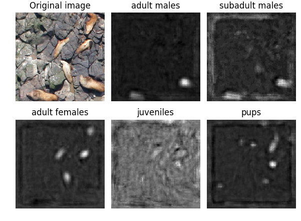
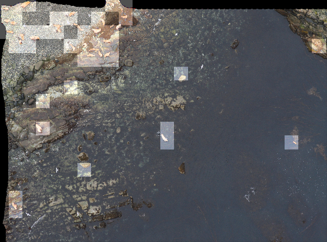

# Sea Lion Population Count

#### Quick overview of solution for Kaggle's [NOAA Fisheries Steller Sea Lion Population Count](https://www.kaggle.com/c/noaa-fisheries-steller-sea-lion-population-count/) (27th position of 393 teams)

#
My approach was started as gaussian density regression, similar to "Interactive Object Counting" by Arteta, Lempitsky, Noble, Zisserman, [link](https://www.robots.ox.ac.uk/~vgg/publications/2014/Arteta14/arteta14.pdf). Final model consists of 3 major parts:

- Sea lion classifier (5+1 classes) trained on 75x75 patches. Implemented as Dilated Residual Networks, DRN (ResNet-18 + Dilated convolution layers). Classification output was removed leaving the model with pixel-level activation of size 138x138 and 512 feature depth for an input tile 276x276. By design, DRN can leave resolution intact, but due to computational issues receptive field has been reduced by a factor of 2 in the first convolutional layer.
- Input tiles 276x276 have been converted into feature maps 138x138x512 and linearly regressed to Gaussian fields centered on sea lions, class-wise. Every Gaussian is normalized to 1, and integration over activation map gives objects count. Linear models have been added on top of DRN as 1x1 convolitional layers. Initially this stage was intended as final, and it worked just perfect on synthetic data giving under 2% error rate. Unfortunately, it was not so good for sea lions. 

The picture demonstrates 2 problems: a) inter-class mis-classification, esp. adult/sub-adult males, b) reconstructed Gaussians sometimes biased towards body shape, thus overestimating density, phenomenon noticed by other participants as well. The reason could be a sub-optimal Gaussian kernel size. (do not pay attention to border artifacts, it's dilated conv features that has been routinely cropped out)  

- Gaussian activations, 138x138, 10 feature depth (I used 2 linear models, 5 activations each) have been fed into simplified variation of ResNet-18 with 5 regression outputs, trained for RMSE loss.  
#
DRN is computationally very intensive. It's purpose localization, and unlike traditional conv models it does not reduce resolution. To filter empty tiles I trained aux VGG-16 binary classifier.

#
There is room for improvement:  
- I considered U-net too, but opted for DRN to avoid deconvolution. This decision has its pros and contras, and I would give U-net a try if started over.
- linear regression to Gaussian fields appears primary source of error. It does not handle well multi-class problem, has issues with different object scales, and difficult to maintain huge (x100) variability of object counts per image. One thing to consider is substitute linear regression with trainable end-to-end non-linear layer

#
Requires:
- Scientific Python Stack (including NumPy, SciPy, Pandas. Can be obtained with Anaconda distribution)
- Keras: The Python Deep Learning library, [link](https://keras.io)

#
Download:

The training and test datasets can be downloaded from [here](https://www.kaggle.com/c/noaa-fisheries-steller-sea-lion-population-count/data)

#
Other good approaches
- AdaBoost, SSD: object detection for lions counting, [link](https://www.kaggle.com/c/noaa-fisheries-steller-sea-lion-population-count/discussion/35462)
- UNet + regression on masksb, [link](https://www.kaggle.com/c/noaa-fisheries-steller-sea-lion-population-count/discussion/35422)
- Real segmentation, [link](https://www.kaggle.com/c/noaa-fisheries-steller-sea-lion-population-count/discussion/35448)
- Heatmap regression + segmentation, [link](https://www.kaggle.com/c/noaa-fisheries-steller-sea-lion-population-count/discussion/35465)
